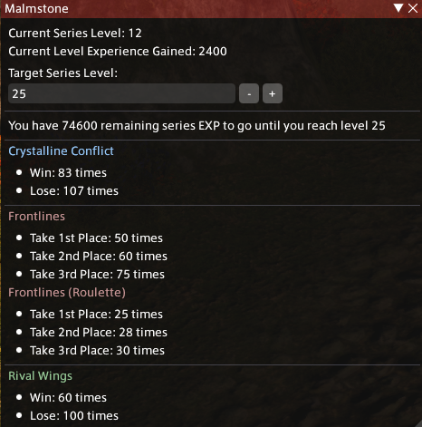
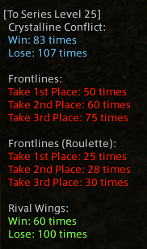

# Malmstone Calculator


A Dalamud plugin that calculates how much more PVP you have to play to reach your target Malmstone Series Level.

```
/pmalm
```
[Commands](https://github.com/pinapelz/ffxiv-malmstone/wiki/Commands)

For an experimental version, please add my custom plugin repository to Dalamud by following the instructions [here](https://github.com/pinapelz/DalamudPlugins)

<div style="display: flex; justify-content: space-between;">
  
  
</div>

Inspired by [belthesar's MalmstoneXPCalculator](https://github.com/belthesar/MalmstoneXPCalculator)
